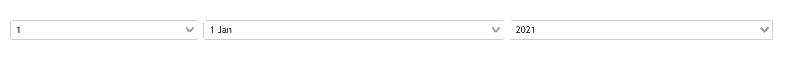

# Vuejs Selectable Date Picker

```<SelectableDate v-model="user.birthDate" />```



## Language options
```
<SelectableDate v-model="user.birthDate" lang="en" />
<SelectableDate v-model="user.birthDate" lang="fr" />
SelectableDate v-model="user.birthDate" lang="de" />
SelectableDate v-model="user.birthDate" lang="ar" />
SelectableDate v-model="user.birthDate" lang="tr" />
```
